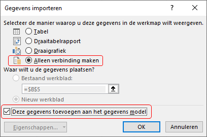
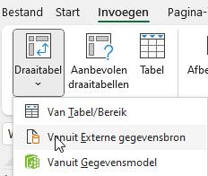
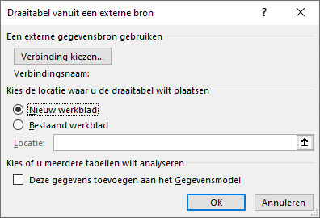
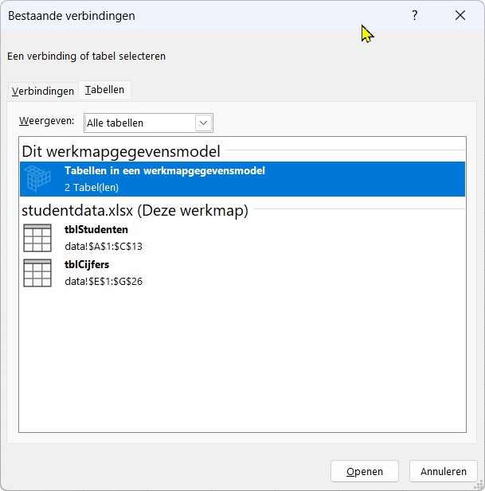
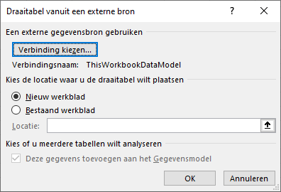
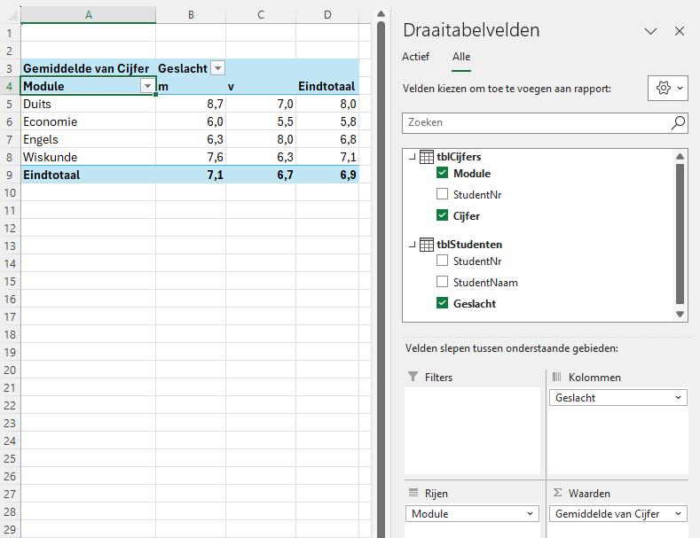

Een datamodel in Excel lijkt op een relationele database, waarin twee of meer tabellen met elkaar verbonden zijn via een gemeenschappelijk veld, het sleutelveld. Dit sleutelveld moet unieke waarden hebben, zoals bijvoorbeeld een persoonsnummer of ordernummer.

Als eenvoudig voorbeeld het bestand [studentdata.xlsx](studentdata.xlsx) dat twee Exceltabellen bevat met modulecijfers van studenten.

-   Tabel `tblStudenten` bevat de persoonsgegevens van de studenten met veld `StudentNr` fungeert als sleutel van deze tabel.

-   Tabel `tblCijfers` bevat de behaalde cijfers per module. De combinatie van `Module` en `StudentNr` is uniek en vormt samen de sleutel van deze tabel.

Omdat beide tabellen het veld `StudentNr` bevatten, kunnen ze via dat veld met elkaar verbonden worden.

Hierna worden drie verschillende manieren besproken om een datamodel voor deze gegevens te maken. Aan het eind wordt een draaitabel gemaakt om de werking van de relaties tussen de tabellen te demonstreren.

## Datamodel maken via de Relaties-functie

Selecteer een willekeurige cel in de tabel `tblStudenten` en kies *Tab Gegevens \> Datamodel (groep Hulpmiddelen voor gegevens) \> Relaties*. In het dialoogscherm "Relaties beheren" klik je op *Nieuw*. Vul het venster "Relaties maken" in zoals in @fig-relatiemaken is weergegeven.

{#fig-relatiemaken}

Klik op *OK*. De relatie wordt nu toegevoegd in het dialoogscherm "Relaties beheren", dat je nu kunt sluiten.

## Datamodel maken met PowerPivot

Selecteer een willekeurige cel in tabel `tblStudenten` en kies *Tab Power Pivot \> Toevoegen aan gegevensmodel*. Sluit daarna PowerPivot.

Selecteer nu een willekeurige cel in de tabel `tblCijfers` en kies opnieuw *Tab Power Pivot \> Toevoegen aan gegevensmodel*.

Kies in het PowerPivot venster voor *Diagramweergave*. Selecteer het veld `StudentNr` in het diagram `tblStudenten` en sleep dit naar het veld `StudentNr` in `tblCijfers`. Er wordt nu **één-op-veel** relatie gemaakt.

{#fig-1opveel}

Sluit daarna het PowerPivot venster.

## Datamodel maken met Power Query

Selecteer een willekeurige cel in de tabel `tblStudenten` en kies *Tab Gegevens \> Van tabel/bereik*. De Power Query Editor wordt geopend.

Kies vervolgens *Tab Start \> Sluiten en laden \> Sluiten en laden naar*. In het dialoogvenster "Gegevens importeren" selecteer je *Alleen verbinding maken* en vink je aan *Deze gegevens toevoegen aan het gegevensmodel* (zie @fig-importeren). Klik daarna op *OK*.

{#fig-importeren}

Herhaal deze procedure voor de andere tabel.

Nu moet de relatie tussen de twee geïmporteerde tabellen nog worden gelegd. Kies hiervoor *Tab Powervivot\> Beheren \> Diagramweergave* en maak de relatie via het veld `StudentNr`, op dezelfde manier als bij de vorige methode.

## Draaitabel maken uit datamodel

De twee tabellen zijn nu onderdeel van het datamodel en via `StudentNr` met elkaar verbonden. Om de werking te demonstreren wordt een draaitabel gemaakt waarmee onderzocht kan worden of het gemiddelde cijfer per module verschilt tussen mannen en vrouwen.

Terug in het werkblad kies *Tab Invoegen \> Draaitabel \> vanuit Externe gegevensbron*.

{#fig-pivot-externebron}

In het dialoogvenster "Draaitabel vanuit een externe bron" klik je op *Verbinding kiezen*.

{#fig-pivot-verbinding-kiezen}

In het venster "Bestaande verbindingen" selecteer je de tab `Tabellen` en kies je `Tabellen in een werkmapgegevensmodel`.

{#fig-verbindingskeuze}

Klik op *Openen*. In het dialoogvenster is nu de verbindingsnaam `ThisWorkbookDataModel` toegevoegd. Kies vervolgens om de draaitabel in een *Nieuw werkblad* te plaatsen en klik op *OK*.

{#fig-pivot-nieuw-werkblad}

In het nieuwe werkblad kun je nu de draaitabelvelden kiezen om bijvoorbeeld het gemiddelde cijferper module en per geslacht weer te geven. In @fig-draaitabel zie je een voorbeeldresultaat.

{#fig-draaitabel}

# Overzicht

**Drie manieren om een datamodel te maken**

| Methode | Kenmerken | Geschikt voor |
|------------------------|------------------------|------------------------|
| Relaties-functie | Snel en eenvoudig, geen extra vensters. | Kleine datasets en basisrelaties. |
| PowerPivot | Geavanceerde modelleermogelijkheden, gebruik van DAX. | Grotere modellen en berekeningen. |
| Power Query | Flexibele gegevensimport en -transformatie. | Gegevensvoorbereiding en combineren van meerdere bronnen. |

# Conclusie

Met deze drie methoden kun je in Excel op verschillende manieren een datamodel opbouwen. Welke methode je kiest, hangt af van je voorkeur en de complexiteit van je gegevens. Door de relaties tussen tabellen goed te definiëren, kun je krachtige analyses maken met draaitabellen en PowerPivot.
